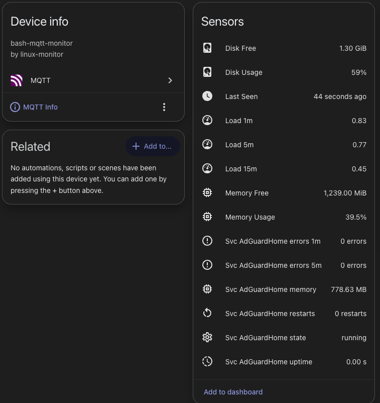

# MQTT System Monitor

{width=400}

A set of portable bash scripts that publish system metrics from Debian/Linux hosts to an MQTT broker, with automatic sensor discovery for [Home Assistant](https://www.home-assistant.io/integrations/mqtt/).

Each host appears in Home Assistant as a single device, with all its sensors grouped under the hostname.

---

## Requirements

- Debian/Linux with `systemd`
- `mosquitto-clients` (`apt install mosquitto-clients`)
- An MQTT broker reachable from the host (no TLS required)
- Home Assistant with the [MQTT integration](https://www.home-assistant.io/integrations/mqtt/) enabled

---

## Files

| File | Purpose |
|------|---------|
| `config.sh` | All user-facing configuration — edit this before running the installer |
| `monitor.sh` | Collects metrics and publishes MQTT discovery + state |
| `install.sh` | Installs as a systemd service + timer (requires root) |
| `uninstall.sh` | Removes the service cleanly (requires root) |
| `check-deps.sh` | Pre-install dependency and configuration check (also run automatically by `install.sh`) |

---

## Installation

**1. Clone or copy the files to the target host.**

**2. Edit `config.sh` before installing:**

```bash
nano config.sh
```

At minimum, set `MQTT_BROKER` to your broker's IP or hostname. The installer copies this file to `/etc/mqtt-monitor/config.sh` on first run, so editing it here means it arrives pre-configured — no need to find and edit it again afterwards.

See the [Configuration](#configuration) section for all available options, including per-service health checks and log file monitoring.

**3. (Optional) Run the dependency and configuration check:**

```bash
bash ./check-deps.sh
```

This checks OS compatibility, required tools, systemd availability, and validates your `config.sh` — including whether each service in `MONITORED_SERVICES` exists as a systemd unit, and whether any `SERVICE_CHECK_CMD` / `SERVICE_LOG_FILE` / `SERVICE_LOG_PATTERN` entries are consistent. The installer runs this automatically and will abort if any required check fails, but running it manually first gives you a cleaner view of any issues before committing to the install.

**4. Run the installer:**

```bash
sudo ./install.sh
```

This will:
- Run `check-deps.sh` and abort if any required check fails
- Install `mosquitto-clients` if not already present
- Copy `monitor.sh` to `/opt/mqtt-monitor/`
- Copy `config.sh` to `/etc/mqtt-monitor/config.sh` (only if it does not already exist there)
- Create a systemd one-shot service and a timer that fires it on the configured interval

**5. Run once to verify:**

```bash
sudo systemctl start mqtt-monitor.service
journalctl -u mqtt-monitor.service -n 50
```

Home Assistant should discover the device within seconds under **Settings → Devices & Services → MQTT**.

**After changing the config, restart the timer to apply:**

```bash
sudo systemctl restart mqtt-monitor.timer
```

---

## Configuration

Edit `config.sh` in the repo directory before installing, or edit the installed copy at `/etc/mqtt-monitor/config.sh` afterwards.

```bash
# Required
MQTT_BROKER="192.168.1.100"
MQTT_PORT="1883"

# Optional hostname override (leave empty to use the system hostname)
HOSTNAME_OVERRIDE=""

# How often metrics are reported, in seconds
INTERVAL=60

# Home Assistant MQTT discovery prefix (default matches HA out of the box)
DISCOVERY_PREFIX="homeassistant"

# Space-separated list of systemd services to monitor
MONITORED_SERVICES="ssh nginx"
```

Sensor names in Home Assistant are derived from the hostname: `{hostname}_{metric}`. The hostname is lowercased and non-alphanumeric characters are replaced with `_`.

---

## Sensors

### System sensors

All published to `linux_monitor/{hostname}/state` as a single JSON payload.

| Sensor | Unit | Notes |
|--------|------|-------|
| Disk Usage | `%` | Root mount (`/`) |
| Disk Free | `GiB` | Root mount (`/`) |
| Load 1m | — | From `/proc/loadavg` |
| Load 5m | — | From `/proc/loadavg` |
| Load 15m | — | From `/proc/loadavg` |
| Memory Usage | `%` | Based on available memory (includes page cache) |
| Memory Free | `MiB` | Available memory (includes page cache) |
| Last Seen | timestamp | UTC ISO 8601; goes stale if the host stops reporting |

### Service sensors

Each service in `MONITORED_SERVICES` produces the following sensors. State published to `linux_monitor/{hostname}/service/{name}/state`.

| Sensor | Unit | Notes |
|--------|------|-------|
| state | — | systemd sub-state: `running`, `exited`, `failed`, `dead`, etc. |
| restarts | restarts | Restart count since last boot |
| uptime | `s` | Seconds since the service last entered active state |
| memory | `B` | RSS from cgroup (requires cgroups v2; 0 if unavailable) |
| errors 1m | errors | journald entries at `warning` priority or higher in the last 1 minute |
| errors 5m | errors | journald entries at `warning` priority or higher in the last 5 minutes |

#### Optional: custom health check

Adds a `check` binary sensor (ON = healthy) for each service that has a command configured.

```bash
# In config.sh
declare -A SERVICE_CHECK_CMD=(
    ["nginx"]="curl -sf http://localhost/health"
    ["postgres"]="pg_isready -q"
    ["myapp"]="/opt/myapp/health_check.sh"
)
```

The command is run with `bash -c` and has a 10-second timeout. Exit 0 = OK, non-zero = fail.

#### Optional: log file error tracking

Adds a `log errors` sensor showing new matching lines per reporting interval (delta, not total). Handles log rotation gracefully.

```bash
# In config.sh
declare -A SERVICE_LOG_FILE=(
    ["nginx"]="/var/log/nginx/error.log"
)

# ERE regex — defaults to "error" if not set
declare -A SERVICE_LOG_PATTERN=(
    ["nginx"]="\\[error\\]|\\[crit\\]"
)
```

State between runs is stored in `/var/lib/mqtt-monitor/`.

---

## MQTT topic layout

```
Discovery (retained):
  homeassistant/sensor/{hostname}_{metric}/config
  homeassistant/sensor/{hostname}_svc_{name}_{metric}/config
  homeassistant/binary_sensor/{hostname}_svc_{name}_check/config

State (not retained):
  linux_monitor/{hostname}/state                          ← system metrics JSON
  linux_monitor/{hostname}/service/{name}/state           ← per-service JSON
```

## Detecting offline or stale hosts

### Why this matters

When a monitored host stops reporting — due to a crash, reboot, power loss, or network outage — it simply stops publishing MQTT messages. Without any extra configuration, Home Assistant has no way to distinguish a stale reading from a current one: the last-published values stay on screen indefinitely, looking healthy even when the host is long gone.

### Option A — `expire_after` (built-in, automatic)

Every sensor published by this project includes `"expire_after": 180` in its MQTT discovery config. This tells the HA MQTT integration to mark a sensor `unavailable` if no new message arrives on its state topic within 180 seconds (3 minutes). As soon as the host stops reporting, its sensors transition from their last value to `unavailable` — making the problem visible in dashboards and triggering any automations that watch for `unavailable` state.

This is automatic and requires no extra HA configuration.

> **Why 3 minutes?** The default reporting interval is 60 s. Three minutes gives a rebooting server time to come back up, reconnect to the broker, and publish a fresh reading — without showing stale data in the meantime.

### Option B — Template binary sensor (explicit on/off entity)

`expire_after` marks sensors `unavailable`, but sometimes you want a dedicated `on`/`off` binary sensor — for example to show a clear problem indicator on a dashboard, use it as a condition in other automations, or apply a different timeout threshold.

Add this to your HA `configuration.yaml`, replacing `sensor.myhost_last_seen` with the actual entity ID for your host (find it under **Settings → Devices & Services → MQTT → *your host* → Sensors**):

```yaml
template:
  - binary_sensor:
      - name: "myhost Offline"
        unique_id: myhost_offline
        device_class: problem
        icon: mdi:server-off
        state: >
          
          {{ last_seen > 0 and (as_timestamp(now()) - last_seen) > 180 }}
        availability: >
          {{ states('sensor.myhost_last_seen') not in ['unavailable', 'unknown'] }}
```

The `availability` template prevents false positives during HA restarts or MQTT reconnects, when the `last_seen` sensor may briefly show `unavailable` even though the host is online. Without it, the binary sensor would briefly turn `on` every time HA restarts.

Both mechanisms complement each other: `expire_after` keeps all sensors clean by marking them `unavailable` at the MQTT layer, while the template binary sensor gives you an explicit, stable entity for dashboards and automations.

---

## Alert Blueprint

An automation blueprint is included that sends Android push notifications when thresholds are exceeded.

[](https://my.home-assistant.io/redirect/blueprint_import/?blueprint_url=https%3A%2F%2Fgithub.com%2FNornode%2Fha-mqtt-system-monitoring%2Fblob%2Fmain%2Fblueprints%2Fautomation%2Fsystem_monitor_alerts.yaml)

Or copy the file manually to `/config/blueprints/automation/` and reload blueprints.

**What you configure in the UI:**

| Input | Description |
|-------|-------------|
| Monitored Host | The MQTT device created by the monitor |
| Disk Usage Threshold | Default 85 % — alert sustained for 2 min |
| Memory Usage Threshold | Default 90 % — alert sustained for 2 min |
| Load Average (15 min) | Default 2.0 — alert sustained for 5 min |
| Last Seen Timeout | Default 5 min — host considered offline |
| Service State Sensor | Optional — alerts when a service enters `failed` state |
| Notification Service | Android companion app notify service (e.g. `notify.mobile_app_my_phone`). For multiple phones use a `notify: group:` in `configuration.yaml`. |

Notifications are tagged per host and alert type so they replace themselves rather than stacking. Each alert type gets its own `channel: SystemAlerts` channel on Android, letting you configure sound and vibration independently in the companion app settings.

---

## Uninstallation

```bash
sudo ./uninstall.sh
```

The config at `/etc/mqtt-monitor/` is preserved. Remove it manually if desired:

```bash
sudo rm -rf /etc/mqtt-monitor
```

Retained MQTT discovery topics remain in the broker until explicitly cleared. To remove a sensor from Home Assistant:

```bash
mosquitto_pub -h <broker> -r -t 'homeassistant/sensor/<hostname>_disk_usage/config' -m ''
```

---

## Useful commands

```bash
# Check timer status
systemctl status mqtt-monitor.timer

# Tail service logs
journalctl -u mqtt-monitor.service -f

# Run once immediately (useful after a config change)
sudo systemctl start mqtt-monitor.service

# Subscribe to all topics for this host
mosquitto_sub -h <broker> -t 'linux_monitor/<hostname>/#' -v
```
